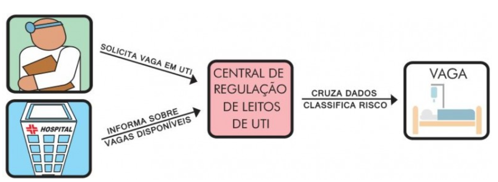

# Problema 2 - Regulação de Leitos de UTI

## A Motivação

A pandemia da COVID-19 trouxe à tona uma série de problemas de infraestrutura na área de saúde. Um deles foi a questão da regulação de leitos de hospitais da rede pública[1]. 

A Figura 1 mostra de forma resumida o processo de regulação de leitos de UTI. Como podemos observar, a central de regulação de leitos cruza informações de demandas por leitos com a disponibilidade de vagas em hospitais para que os pacientes possam ser encaminhados a um leito disponível.

*Figura 1 - Esquema de funcionamento de uma central de regulação de leitos de UTI.*

As solicitações de vagas classificam os pacientes em uma escala de gravidade,  seguindo protocolos internacionais. O Protocolo de Manchester utiliza uma escala de cores: *Emergência* (Vermelho), *Muito Urgente* (Laranja), *Urgente* (Amarelo), *Pouco Urgente* (Verde) e *Não Urgente* (Azul). Apenas os 3 primeiros casos necessitam de vaga em UTI, os demais podem ser encaminhados a leitos de enfermarias ou mesmo ao atendimento ambulatorial.

As vagas de UTI são classificadas pela idade do paciente em: *Neonatal*, *Pediátrico* e *Adulto*. Essas vagas não são intercambiáveis e correspondem às faixas etárias de 0 a 11 meses, 1 a 13 anos e acima dos 13 anos, respectivamente. É importante considerar que os leitos de uma mesma categoria são alocados priorizando-se aqueles mais recentemente liberados. 

No processo de regulação, leitos podem estar disponíveis a espera de pacientes e pacientes podem estar à espera de leitos. Neste último caso, o acesso ao leito deve respeitar o tempo de espera do paciente e a gravidade de seu estado. 

O tempo de espera pode ser um problema nesse tipo de situação, pois o paciente pode piorar sua condição e mudar de escala de gravidade ao longo do processo. Da mesma forma, os tratamentos aplicados durante o tempo de espera podem melhorar sua condição ao ponto de seu caso não necessitar mais de internação em UTI. 

Os pacientes são identificados pelo seu registro no SUS, de forma única. Os leitos são identificados por um número sequencial associado ao código do hospital onde se localiza. 

Uma vez que o leito é associado a um paciente, o sistema de regulação deixa de acompanhar o processo de uso do leito, até que este esteja novamente liberado e retorne ao sistema de regulação.

## O Problema

Uma empresa que desenvolveu um sistema de regulação de leitos para estados e municípios baianos durante a pandemia está com processo seletivo aberto. A empresa decidiu inovar e solicitou aos candidatos que elaborassem um estudo com foco nas **estruturas de dados** e seus **algoritmos** [2], necessários para o funcionamento do núcleo do sistema de regulação.

Os donos da empresa, ex-programadores com grande experiência em desenvolvimento de algoritmos e estruturas de dados, irão avaliar seu projeto por meio de um protótipo, que simulará o processo de entradas e saídas de leitos e pacientes no sistema. O uso correto de conceitos como **TADs** e **modularização** [3] do código na construção do protótipo também será avaliado. O uso de boas práticas [4] no seu código também será avaliado. 

O seu protótipo/simulador deve ser capaz de criar, de forma aleatória, demandas e disponibilidade de leitos. O sistema deve então gerenciar a alocação dos leitos e, se necessário, a espera por leitos. Um mapa da situação do sistema deve ser apresentado a cada instante, onde possamos ter ideia da situação do processo, ou seja, identificar se o sistema está sobrecarregado ou com subutilização.  

Os donos da empresa enfatizaram que não há necessidade de uma interface gráfica “sofisticada”, já que estão mais preocupados com a eficiência dos seus algoritmos e estruturas de dados que vocês irão utilizar. 

Um requisito importante para os donos da empresa é que o núcleo deve ser genérico e versátil, uma vez que a sua vaga visa suprir os planos da empresa de expandir seu sistema para suporte a leitos ambulatoriais e até consultas. 

Outro requisito fundamental é que a codificação deve ser feita em *Python*. Porém, como o objetivo é verificar o seu dominio de estruturas de dados e seus algoritmos, **o uso de estruturas prontas da linguagem *Python* está vedado**. Você deve construir todas as estruturas de dados que vier a utilizar no seu simulador.

## O Produto
	
O projeto deve ser entregue em 03/11/2022, contendo:

* O repositório do código fonte do simulador; 
* Um relatório técnico resumido, descrevendo o seu projeto, as escolhas dos algoritmos e estruturas de dados utilizados no desenvolvimento do núcleo, apresentando justificativas para cada escolha no projeto.    

## A Avaliação:

Sua solução será avaliado pelos seguintes critérios:

| Critério | Pontuação |
| :--- | :---: |
| 1. Relatório completo (README em Markdown[4][5]) | 1,0 |
| 2. Modularização do código | 0,5 | 
| 3. Escolha adequada dos TADs | 1,0 |
| 4. Controle de leitos     | 2,5 |
| 5. Controle de pacientes  | 2,5 |
| 6. Simulador  | 2,5 |

## Observações Gerais:

**Plágio não é uma prática aceitável nem na academia nem no mercado de trabalho. 
Uma vez detectada TODOS os envolvidos serão penalizados.**

Não presuma nada! Pergunte ao professor, monitor ou estagiário docente. 

Discussões conceituais e de interpretação do problema podem ser feitas no canal do problema no *Discord*. 

Dúvidas específicas relacionadas a sua solução ou ao seu código  devem ser feitas em consultas privadas no *Discord* ou com *issues* no *github Classroom* 

# Referências Bibliográficas:

[1] 	Governo do Estado da Bahia. Sistema de Regulação. disponível em: http://www.saude.ba.gov.br/atencao-a-saude/comofuncionaosus/sistema-de-regulacao/ 

[2] Cormen,T.H., Leiserson,C.E., Rivest,R.L., Stein,C. **Algoritmos – Teoria e Prática**. Editora Campus. 3a Edição, 2012..

[3] Canning, J., Broder, A., Lafore, R. **Data Structures & Algorithms in Python**. Addison-Wesley. 2022.

[4] Erica Vartanian, **"6 coding best practices for beginner programmers"**. Disponível em:  https://www.educative.io/blog/coding-best-practices

[5] Matt Cone, **Markdown Cheat Sheet - A quick reference to the Markdown syntax**. Disponível em: https://www.markdownguide.org/cheat-sheet/

[6] GitHub Docs. Introdução à escrita e formatação no GitHub. Disponível em: https://docs.github.com/pt/github/writing-on-github/getting-started-with-writing-and-formatting-on-github

