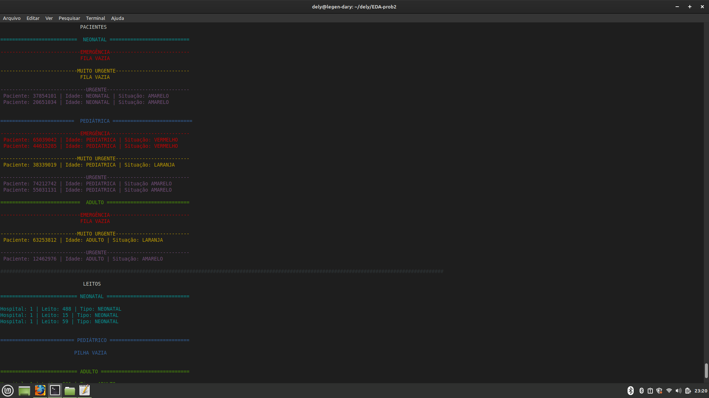
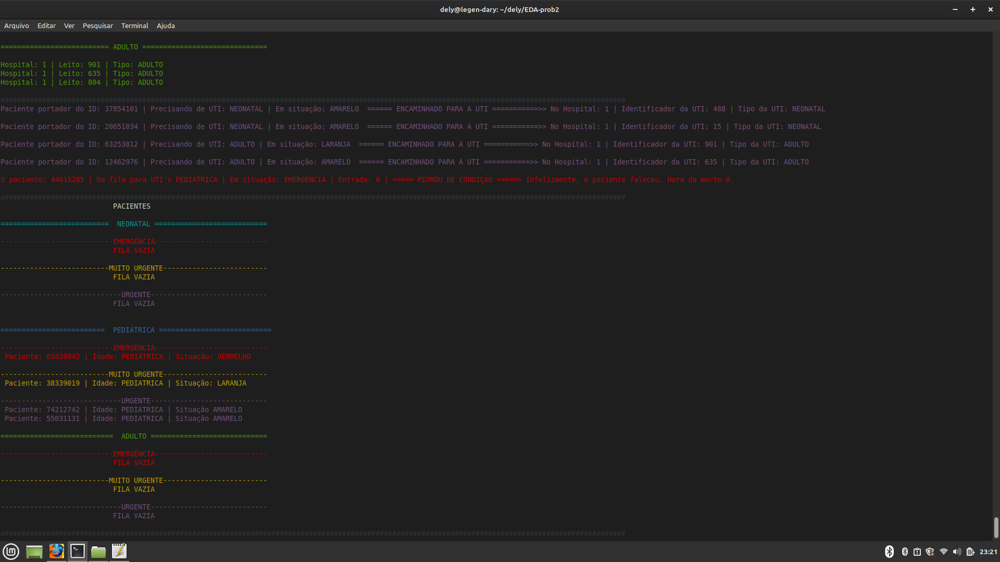
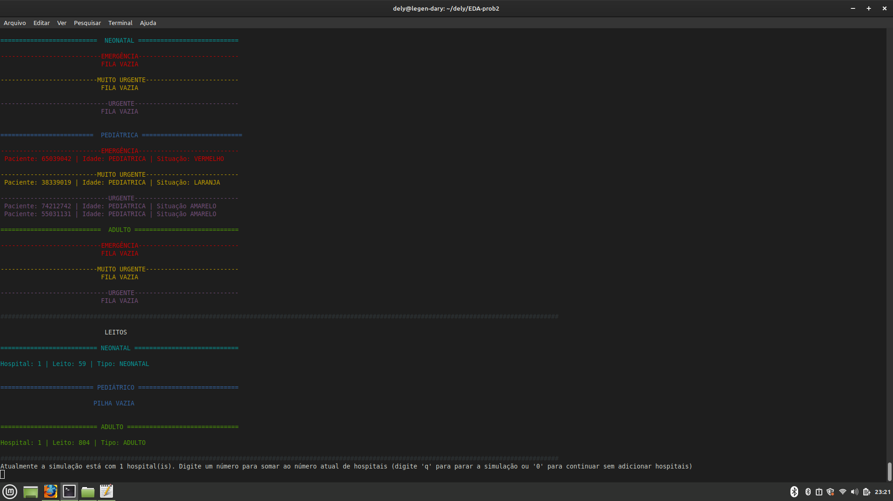

# Problema 2 - Regulação de Leitos de UTI
## Estruturas usadas no programa:
1. `patient.py` arquivo contendo a classe que cria objetos do tipo "paciente".
2. `leitos,py` arquivo contendo a classe que cria objetos do tipo "leito".
3. `waitqueue.py` classe que cria "filas de espera" (um modelo adaptado das estruturas de filas genéricas).
4. `stack.py` classe que cria pilhas de tamanho dinâmico para armazenar os leitos.
5. `cNo` classe para criar nós para a utilização do encadeamento nas duas estruturas anteriores.
6. `poolleitos.py` classe que cria um ambiente para armazenar as três pilhas que contém os leitos disponíveis de acordo com o seu tipo.
7. `room.py` classe que cria uma espécie de ambiente para armazenar 3 filas de espera, de acordo com a gravidade.
8. `waitroom.py` classe que cria 3 objetos do tipo `room.py`, formando uma estrutura capaz de gerenciar 9 filas de espera, separadas primeriamente por TIPO, em seguida por GRAVIDADE.
9. `generateEvents.py` função que é responsável por gerar os casos de teste da simulação.
10. `main.py` o arquivo que deve ser chamado na linha de comando para executar a simulação.

### As escolhas das estruturas:
Escolher trabalhar com lista encadeada pareceu uma escolha direta, pois não temos um tamanho máximo fixo de pacientes a serem armazenados no sistema. Para os leitos existe o mesmo problema, não sabemos o máximo de leitos que poderemos receber, então as estruturas estão preparadas para lidar com grandes volumes de dados.

Para o armazenamento de pacientes foram utilizadas estruturas do tipo *FILA* (pois a ordem de chegada determinava a ordem de atendimento) e para o armazenamento de leitos foram utilizadas estruturas do tipo *PILHA* (pois os leitos mais recentemente incorporados ao sistema eram logo liberados para um paciente).

### Sistema com núcleo individual para pacientes e individual para leitos:
A estrutura `waitroom.py` é capaz de operar independentemente, apenas alocando pacientes, assim como a estrutura `poolleitos.py` é capaz de operar apenas alocando leitos, ambas não necessariamente precisam se comunicar para funcionarem. Deste modo, ambas cumprem suas respectivas funções, a primeira, é capaz de lidar com o armazenamento de pacientes e a segunda com o armazenamento de leitos.

### Como os eventos são gerados:
A função contida no arquivo `generateEvents.py` utiliza a biblioteca `random` para sortear o recebimento de pacientes, ou de leitos, ou ainda nenhum acontecimento(até porque, não receber nenhum paciente e nenhum leito é uma possibiliade no dia a dia do sistema).
Após o sorteio definir se serão gerados leitos ou pacientes ele sorteia a quantidade, e para cada paciente ou leito dentro de suas respectivas quantidades, o código sorteará suas atribuições (para pacientes: ID DO PACIENTE, TIPO DE LEITO, ESTADO DE URGÊNCIA; para leitos: HOSPITAL, ID DO LEITO, TIPO DE LEITO). Os sorteios dos Id's, tanto de pacientes quanto de leitos, utilizaram de multiplicação por primos, já que o produto de um número por um primo é único. Esse artifício foi utilizado apenas para reduzir as chances de dupla atribuição de Id's. Como leitos têm alta rotatividade, a repetição não necessitava um sorteio muito meticuloso. Porém, pacientes podem ficar na fila de espera por muito tempo devido a sua alta ocorrência e sua possibilidade de piorar ou melhorar(mudando para o final de outra fila), portanto, o sorteio para Id's de pacientes segue operações matemáticas sucessivas com primos, para diminuir ainda mais a chance de dupla ocorrência.

## Interface do programa:
Para o funcionamento do programa basta que o arquivo `main.py` seja executado na linha de comando, seguido ou não, do número de hospitais que o usuário deseja colocar na simulação.
Inicialmente, a função `generateEvents` irá gerar uma situação atual do sistema. Em seguida, a saída exibirá uma Lista contendo a situação atual da fila de espera dos pacientes e das pilhas que armazenam leitos. Após isso, os leitos serão devidamente atribuidos e a saída exibirá qual paciente foi encaminhado para qual leito(estes sendo identificados pelos seus respectivos Id's). Após isso, o programa processará a possível mudança de estado dos pacientes que estão na fila, exbindo em *VERDE* quais pacientes melhoraram (qual era o estado anterior dele e qual é o estado dele agora) e exibindo na cor *VERMELHA* quais pacientes pioraram (exibindo também, qual era o estado dele e para qual estado ele piorou). Por fim, o programa exibe a situação final das filas de espera e das pilhas de leitos, para comparação da realização das devidas operações. Uma mensagem na tela será exibida, perguntando ao usuário se ele gostaria de adicionar mais hospitais à simulação (mais hospitais caracterizam mais chances de mais leitos serem gerados), diminuir o número de hospitais (basta colocar um número negativo, mas caso a subtração do número atual pelo número que o usuário adicionou seja menor que 1, a simulação para) ou parar o programa(digitando a letra 'q').
### Exibição da interface do programa:

As cores por padrão do python não eram tão vastas, portanto as gravidades estão identficadas pelas suas respectivas cores, em forma de string, segundo o Protocolo de Manchester, ao lado de cada paciente.
Nas imagens: 
1. EMERGÊNCIA = COR VERMELHA.
2. MUITO URGENTE = COR AMARELA.
3. URGENTE = COR MAGENTA. 

No Protocolo de Manchester e ao lado de cada paciente:
1. EMERGÊNCIA = VERMELHO
2. MUITO URGENTE = LARANJA
3. URGENTE = AMARELO
